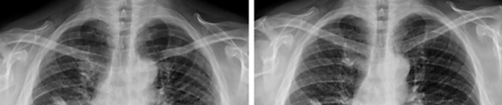

# COVID-19 Detection 

## Overview
#### The project is live [here](https://covid-19-detection-1d3l.onrender.com/docs) check it out.

This project involves End-to-end ML-project. from developing a Convolutional Neural Network (CNN) model based on the ResNet50 architecture to detect COVID-19 from X-ray images to building the API with the help if [FastAPI](https://fastapi.tiangolo.com/). with containerinzation using [Docker](https://www.docker.com/)



 The model was trained on a dataset with 148 examples, with F1 score 0.8696 and achieved an accuracy of 97.5%.

 ## Requirements
  1. [GitHub](https://github.com/)
 2. [Docker](https://www.docker.com/)

## Files
- `code.ipynb`: Contains all the code for data preprocessing, model training, and evaluation.

- `COVID DataSet.zip`: The dataset used for training and testing the model.
- `Dockerfile` with the  containerization of the project.
- The `/app` directory have all the file related to the Ops 
   - With `/app/main.py` as the file containing FastAPI.
   - With `/app/model.h5` the trained model.
   - With `/app/requirement.txt` having the required libraries.


## Model Performance
- **Accuracy:** 97.5%
- **F1 Score:** 0.8696 
- **Training Data:** 148 X-ray images

## Usage
- ### Using deployed API:
    1. Just download the `app/app.py` file
    2. Run the following command in the terminal
        ```bash
        pip install streamlit
        streamlit run app.py
        ``` 
        by runing these commands a
        ```bash 
            You can now view your Streamlit app in your browser.

            Local URL: http://localhost:8501
            Network URL: http://172.25.97.164:8501
        ```
        this type of window will be shown and you can open the app by following the link provided.
- ### Using Docker Image :
    1. **Clone the Repository**: [Clone this repository]('https://github.com/arihant1805/COVID-Detection.git')
    2. **Open the Repository**: Go to the cloned repository
    3. **Run Docker Image**: use ```$ docker run covid-19-detection``` in the bash.
    4. **Check the FastAPI**: Check the API at the ```/predict/docs ```
- ### Manually :
    1. **Clone the Repository**: [Clone this repository]('https://github.com/arihant1805/COVID-Detection.git')
    2. **Open the Repository**: Go to the cloned repository
    3. **Go to the app**:use  ```$ cd app``` in the bash.
    4. **Install required libraries** run ```$ pip install -r requirements.txt```
    5. **Run the app**: use ```$ uvicorn main:app``` in the bash.
    6. **Check the FastAPI**: Check the API at the ```/predict/docs ```


## License
This project is licensed under the Apache License 2.0. See the [LICENSE](LICENSE) file for details.
